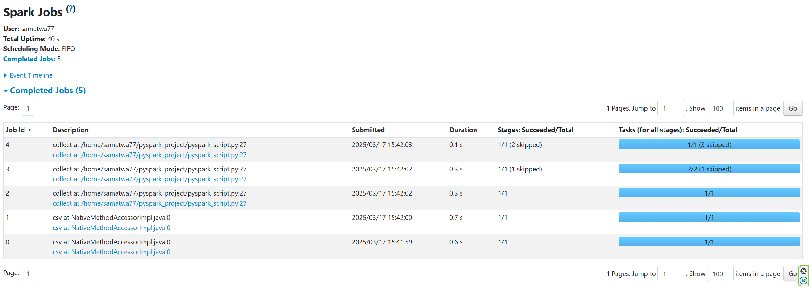

# goit-de-hw-04

# Опис Jobs:
## Job 1 — Інференс схеми CSV
Spark читає кілька рядків з файлу для визначення типів колонок, оскільки використано .option("inferSchema", "true").
Легка операція, окремий Job для цього.
## Job 2 — Читання CSV, фільтрація, селект, підготовка до shuffle (Map Stage)
Spark повністю читає CSV-файл.
Застосовує .where("final_priority < 3") та .select("unit_id", "final_priority").
Потім готує дані для групування — це Map Stage.
Результати діляться по ключу unit_id для подальшого shuffle.
## Job 3 — Виконання shuffle та агрегація (Reduce Stage)
Тут відбувається shuffle (перемішування даних між виконавцями за ключами unit_id).
Далі Spark виконує .count() для кожної групи.
Це Reduce Stage — збирання та підрахунок.
## Job 4 — Фільтрація .where("count>2")
Додаткова фільтрація вже після групування.
Spark запускає окремий етап для застосування цього фільтру.
## Job 5 — Збирання результатів (Collect)
Після всіх трансформацій Spark збирає результати на драйвер для .collect().
 

