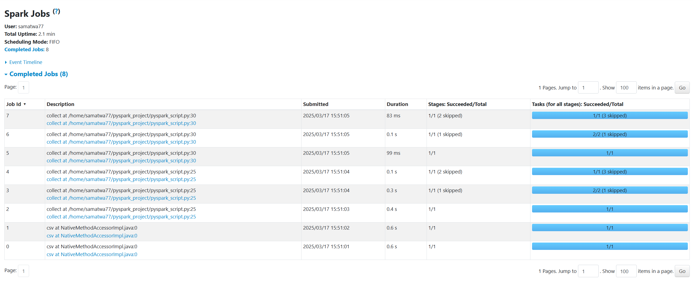

# goit-de-hw-04
# Частина 1

## Опис Jobs:
## Job 1 — Інференс схеми CSV
Spark читає кілька рядків з файлу для визначення типів колонок, оскільки використано .option("inferSchema", "true").
Легка операція, окремий Job для цього.
## Job 2 — Читання CSV, фільтрація, селект, підготовка до shuffle (Map Stage)
Spark повністю читає CSV-файл.
Застосовує .where("final_priority < 3") та .select("unit_id", "final_priority").
Потім готує дані для групування — це Map Stage.
Результати діляться по ключу unit_id для подальшого shuffle.
## Job 3 — Виконання shuffle та агрегація (Reduce Stage)
Тут відбувається shuffle (перемішування даних між виконавцями за ключами unit_id).
Далі Spark виконує .count() для кожної групи.
Це Reduce Stage — збирання та підрахунок.
## Job 4 — Фільтрація .where("count>2")
Додаткова фільтрація вже після групування.
Spark запускає окремий етап для застосування цього фільтру.
## Job 5 — Збирання результатів (Collect)
Після всіх трансформацій Spark збирає результати на драйвер для .collect().

# Частина 2. 

## Опис Jobs:
## Job 1 — Інференс схеми CSV
Як і раніше, Spark читає кілька рядків для визначення схеми.
## Job 2 — Читання CSV, фільтрація, селект, підготовка до shuffle (Map Stage) для першого .collect()
Повне читання даних.
Фільтрація, селекція та підготовка до групування.
## Job 3 — Shuffle + групування + count (Reduce Stage) для першого .collect()
Shuffle та агрегація груп.
## Job 4 — Збирання результатів (Collect)
Spark збирає підраховані групи назад на драйвер для першого .collect().
## Job 5 — Читання CSV, фільтрація, селект, shuffle (Map Stage) для другого .collect()
Spark не кешує попередні обчислення!
Він починає обчислення з самого початку.
Знову читає файл, застосовує фільтри та готує дані до shuffle.
## Job 6 — Shuffle + групування + count (Reduce Stage) для другого .collect()
Знову shuffle та агрегація.
## Job 7 — Додаткова фільтрація .where("count>2")
Застосування фільтру після групування.
## Job 8 — Збирання результатів (Collect)
Другий виклик .collect() збирає результати на драйвер.

## Питання 1: Подумайте, чому при додаванні однієї проміжної дії nuek_processed.collect(), отримано аж на 3 Job більше?
Відповідь:
* Проміжне .collect() розриває DAG
* Spark після кожного .collect() змушений перераховувати всі трансформації заново.
* У другому прикладі Spark робить повне читання та групування двічі, що й додає 3 додаткові Jobs.

# Частина 3.

## Опис Jobs:
## Job 1 — Інференс схеми CSV
Spark читає перші рядки CSV для визначення типів колонок.
Це завжди окремий Job, коли вказано .option("inferSchema", "true").
## Job 2 — Читання CSV, фільтрація, селекція, підготовка до shuffle (Map Stage)
Spark повністю читає файл.
Виконує фільтрацію .where("final_priority < 3").
Вибирає потрібні колонки.
Готує дані для групування — Map Stage, де дані діляться по ключу unit_id.
## Job 3 — Shuffle та групування, підрахунок (Reduce Stage)
Тут Spark виконує Shuffle, передаючи ключі unit_id між виконавцями.
Далі рахує кількість записів для кожної групи — Reduce Stage.
## Job 4 — Materialization для cache()
Після завершення групування та підрахунку Spark зберігає результат у пам’яті або на диск.
Це окремий Job для запису кешу.
Важливо: cache не запускається самостійно, лише коли відбувається action, як .collect().
## Job 5 — Перший .collect()
Spark збирає обчислені та кешовані дані на драйвер.
Даний Job працює вже на кешованих даних.
## Job 6 — Додаткова фільтрація .where("count>2")
Тепер Spark застосовує додатковий фільтр до кешованого результату.
Працює тільки з кешем, не перечитує CSV.
## Job 7 — Другий .collect()
Збирає результат після фільтрації.

## Питання 2: Подумайте, чому при використанні cache() ми зменшили кількість Job?
Відповідь:
* Якщо не використовувати .cache(), кожен .collect() буде перераховувати всі попередні трансформації знову, включаючи читання CSV і groupBy (і створювати shuffle stages заново).
* Використовуючи .cache(), Spark:
 - Один раз обчислює і зберігає результат.
 - При наступному .collect() використовує вже готовий кеш, а не повторює всю роботу.
 - Це значно зменшує кількість повторних Jobs і покращує продуктивність.

## Висновки:
* Кеш допомагає уникнути повторного виконання DAG і зайвих Jobs.
* Але перше кешування само потребує додатковий Job
* Додавання додаткового .collect() без кешу → кожен раз Spark виконує все заново → більше Jobs.

